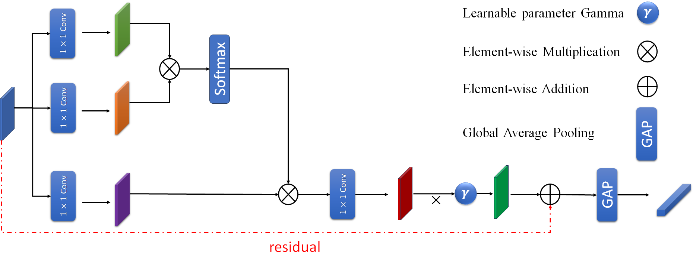

# Enhancing Few-Shot Image Classification through Learnable Multi-Scale Embedding and Attention Mechanisms
Implementation of a Few-Shot Image Classification Model based on the Prototypical Network Model and Tested on the MiniImagenet and FC100 Datasets.

For more information, check out our paper on [[arXiv](https://arxiv.org/abs/2409.07989)].

## Table of Contents

1. [Project Description](#project-description)
2. [Model](#model)
3. [How to run](#how-to-run)
4. [Results](#results)
5. [Refrences](#refrences)


## Project Description

In this project, we propose an enhanced model for few-shot image classification based on the Prototypical model. Our main objective is to improve the accuracy of the model through various techniques such as modifying the backbone architecture, employing multiple embedding spaces, assigning weight parameters to each output vector, and incorporating self-attention mechanisms.

We evaluate the effectiveness of our approach on the MiniImagenet training dataset, comparing our results with existing models described in relevant papers. Specifically, we focus on two tasks: 5-way 5-shot and 5-way 1-shot. In the 5-way 5-shot task, we achieve an accuracy of 84.42%, while in the 5-way 1-shot task, we achieve an accuracy of 64.46%.

Furthermore, we demonstrate the generalizability of our model by testing it on an unseen dataset without prior training and observe good accuracy. Overall, this project contributes to the field of few-shot image classification by presenting an improved model and demonstrating its superior performance in addressing the challenges of few-shot learning tasks.

## Model

Our model consists of the following components:
1. We employed different feature spaces and extracted feature maps at five stages to capture both global and task-specific features.
2. We integrated learnable parameter weights at each stage.
3. We utilized a self-attention mechanism for each feature map obtained from every stage to capture more valuable information.

The final model architecture is as follows:


The mapper architecture is as follows:



You can study the model in more detail from this [PDF](finalreport.pdf).

## How to run

I have organized the code step by step as follows:
1. If you only want to run the Prototypical network model [[This folder]](JustPrototypical)
2. Code for implementing the MultiScale approach to the Prototypical model [[This folder]](Prototypical+multiscale)
3. Code for assigning weights to each stage [[This folder]](Prototypical+multiscal+WeightLearnable)
4. The code for the final model [[This folder]](Prototypical+multiscal+WeightLearnable+Self-attention)


For the 5-way 5-shot:
```bash
python train.py --max-epoch 200 --save-epoch 20 --shot 5 --query 10 --train-way 30 --test-way 5 --save-path ./save/proto-5-change --gpu 0
```

For the 5-way 1-shot:
```bash
python train.py --max-epoch 200 --save-epoch 20 --shot 1 --query 10 --train-way 20 --test-way 5 --save-path ./save/proto-1-change --gpu 0
```
## Results

### Step-by-Step Results
|        | 1-shot 5 way| 5-shot 5 way|
| ------ | ------| -----|
| baseline | 62.67 |82.06 |
| Baseline + multiscale |  63.64 | 83.02 |
| Baseline + weighted multisca              |65.14| 83.5 |
| Baseline + weighted multiscale + attention| 64.46 | 84.42 |

### Comparison with Other Models

|        | 1-shot 5 way| 5-shot 5 way|
| ------ | ------| -----|
| AdaResNet | 56.88 | 71.94 |
| TADAM | 58.50 | 76.70 |
| MetaOptNet | 62.64 | 78.63 |
| Neg-Margin | 63.85 | 81.57 |
| MixtFSL | 63.98 | 82.04 |
| Meta-Baseline | 63.17 | 79.26 |
| Distill | 64.82 | 82.14 |
| ProtoNet | 62.39 | 80.53 |
| Set Feat | 68.32 | 82.71 |
| Our model | 64.46 | 84.42 |

### Examples of Correct and Incorrect Predictions

|        |   1-shot 5 way   |    5-shot 5 way   |
| ----------- | ----------- | ----------- |
|    Correct   |        |      |
|     InCorrect   |         |         |

## Refrences

https://github.com/sicara/easy-few-shot-learning

https://github.com/heykeetae/Self-Attention-GAN

https://github.com/yinboc/prototypical-network-pytorch


## Citation
If you use this repository in your work, please cite the following paper:
```bibtex
@article{askari2024enhancing,
  title={Enhancing Few-Shot Image Classification through Learnable Multi-Scale Embedding and Attention Mechanisms},
  author={Askari, Fatemeh and Fateh, Amirreza and Mohammadi, Mohammad Reza},
  journal={arXiv preprint arXiv:2409.07989},
  year={2024}
}
